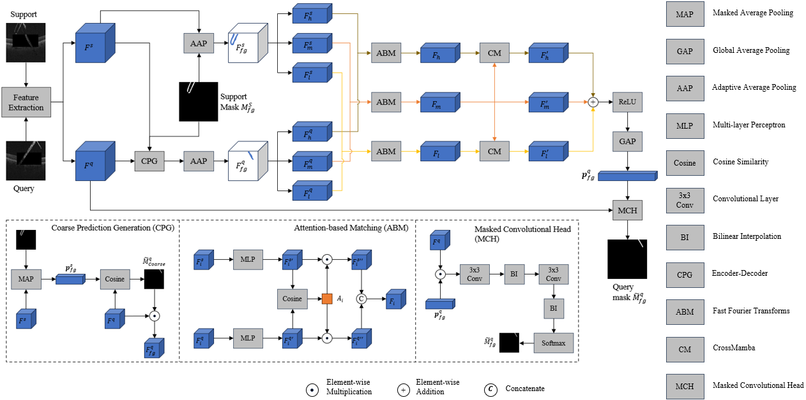

# iOCTMFSS



## ⚠️ License & Usage

Copyright (c) 2025 Minghan Zhao and King's College London  
**All rights reserved.**

This repository is released under a **non-permissive license**.  
- The code is provided **for academic review only**.  
- **Redistribution, modification, or usage of this code, in whole or in part, is prohibited** without prior written permission from the copyright holders.  

For permission requests, please contact:  
📧 xiaotaiyangzmh@163.com

## ⏳ Quick start

### 🛠 Dependencies
Please install the following essential dependencies:
```
json5==0.8.5
jupyter==1.0.0
numpy
opencv-python
sacred==0.8.2
torch
torchvision
tqdm==4.62.3
yacs
matplotlib
mamba-ssm
```

### 📚 Weights
Please download:
1. Pre-trained ResNet-50 weights [deeplabv3 version](https://download.pytorch.org/models/deeplabv3_resnet50_coco-cd0a2569.pth) and put it under ./weights
2. Our pre-trained iOCTMFSS for inference from [Google Drive](https://drive.google.com/file/d/1k2qOSpLajy_Cy2N3ymlzqsiLzJQPG_be/view?usp=sharing)

### 🔥 Training
Run `./script/train_oct2ioct.sh`

### 🙏  Inference
Run `./script/test_oct2ioct.sh` 

## 🥰 Acknowledgements
Our code is built upon the works of [FAMNet](https://github.com/primebo1/FAMNet), we appreciate the authors for their excellent contributions!

